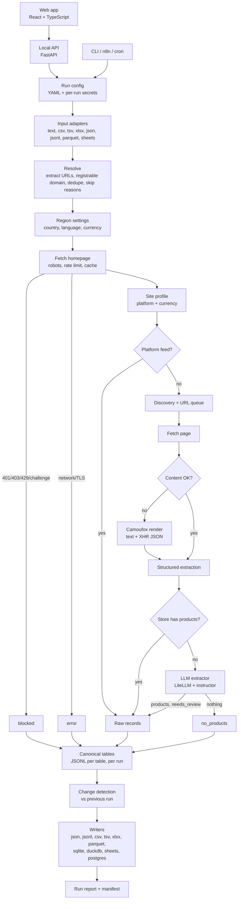

# Architecture

**Updated:** 2026-10-05
**Requirements:** [PRD](../product/prd.md)
**Decisions:** [0001](../decisions/0001-layered-acquisition-llm-last.md) ·
[0002](../decisions/0002-camoufox-for-rendering-only.md) ·
[0003](../decisions/0003-plain-python-orchestration-file-output.md) ·
[0004](../decisions/0004-llm-gateway-litellm-instructor.md) ·
[0006](../decisions/0006-tidy-tables-multiformat-writers.md) ·
[0007](../decisions/0007-typescript-web-ui-local-api.md)

`scrapebot` takes a bulk list of store links in any format, collects raw data from each
store (products, prices, vendors, wholesale pages, page text, contacts), and writes it
to the formats the operator picks. The data feeds a later analysis: which stores are
competitors and which are potential wholesale partners. The bot collects; people decide.

Each part below is marked:

- **Built**: in the code today (v1 and milestone M0).
- **Planned**: in the [roadmap](../planning/roadmap.md).
- **Gated**: built only if the M1 survey shows enough stores need it.

---

## 1. Principles

1. **Cheapest and most exact source first.** Feed, then structured data, then browser,
   then LLM.
2. **Every input link is accounted for.** Links in = processed + skipped, with a reason
   for every skip.
3. **Raw means raw.** Values are stored as found, with their source and evidence URL.
4. **No access control is bypassed.** See
   [ADR 0002](../decisions/0002-camoufox-for-rendering-only.md).
5. **Everything is an adapter.** Inputs, feeds, renderer, LLM provider and outputs are
   chosen in config.
6. **Tests never touch the network.**

## 2. System view



## 3. Entry points

| Entry point | Role | Status |
|---|---|---|
| CLI | `scrapebot run <input>`, optionally with a YAML config. Used directly and by automation (n8n, cron) | Built |
| Web app + local API | `scrapebot serve`: React + TypeScript (`web/`) over a local FastAPI service (`api/`) on 127.0.0.1. Paste or upload links, preview, choose formats, test mode with a gate before untested full runs, live progress (SSE), history, downloads ([ADR 0007](../decisions/0007-typescript-web-ui-local-api.md)) | Built (LLM settings come with M3) |

Both build the same `RunConfig`. The pipeline is split into `prepare` (read and
resolve the input, create the run folder with `config.json` and the `inputs` table)
and `execute` (visit stores, export, report). The API runs `execute` in a single
background worker, one run at a time; a closed browser or a restarted server loses
nothing, because the run folder is the source of truth. `report.md` is written last,
so its presence marks a finished run; a folder without it and no live worker is shown
as *interrupted*.

API routes: `GET /api/options`, `POST /api/uploads`, `POST /api/preview`,
`POST /api/runs`, `POST /api/runs/{id}/full`, `GET /api/runs`, `GET /api/runs/{id}`,
`GET /api/runs/{id}/events` (SSE), `GET /api/runs/{id}/download/{key}`. The web app's
TypeScript types are generated from the API's OpenAPI schema (`make api-types`); CI
fails when they drift.

```yaml
# config.yaml (example)
input:
  source: data/prospects.xlsx      # or pasted text from the UI
  url_column: auto                 # or a column name
  max_links: 1000
region:
  country: US                      # ISO 3166-1 alpha-2
  language: en                     # ISO 639-1
  currency: auto                   # from the country via babel, or a code
llm:
  model: gemini/<model-name>       # any LiteLLM provider/model
  fallback: [openai/<model-name>, ollama/<model-name>]
  budget_usd: 5
render:
  enabled: true                    # Camoufox, when installed
  max_pages: 10
output:
  writers: [xlsx, parquet, sqlite]
limit: 2                           # test mode; null for a full run
```

## 4. Stages

### 4.1 Input and resolve — Built (Google Sheets planned)

- **Built** (`inputs/`): pasted free text and `.txt`, `.csv`, `.tsv`, `.xlsx`,
  `.json`, `.jsonl`, `.parquet`. URLs are extracted from any text (`urlextract`) and
  grouped by registrable domain (`tldextract` with its bundled Public Suffix List, so
  no network call; private suffixes on, so `a.myshopify.com` and `b.myshopify.com`
  stay apart; store hosts the list misses, such as `bigcartel.com` and
  `squarespace.com`, are kept apart by `HOSTED_STORE_DOMAINS`). The URL column is
  found by name or content; every input field is kept as metadata. Deep links mark
  the store and are fetched as priority pages. Skip reasons: `duplicate`,
  `over_limit`, `no_website`, `invalid_url`, `social_only`, `marketplace`. Inputs
  over `max_links` are refused before any fetch.
- **Planned:** Google Sheets input (M5).

### 4.2 Region settings — Planned

Country and language come from ISO lists (`pycountry`). The expected currency follows
the country (`babel`) unless set. Phone numbers are parsed with the chosen default
region (`phonenumbers`). Page language is detected and recorded
(`lingua-language-detector`). An input row may carry its own `country` or `language`.

HTTP requests still send no `Accept-Language` header, so stores answer in their base
currency. When the browser is used, its locale and timezone follow the chosen region.

### 4.3 Fetch — Built, extended

`Fetcher` is the only code that touches the network: `robots.txt` per URL, 1.5 s delay
per domain, cache, retries with backoff, broken TLS retried once without verification
and flagged `ssl_bypassed`. Only successful responses are cached, so a re-run retries
every failure. `Fetcher` is a Protocol; `HttpFetcher` is the HTTP implementation.
**Planned:** move to `httpx` with `hishel`, `tenacity`, `aiolimiter` and `protego` so several domains run in
parallel while each keeps its own delay.

### 4.4 Site profile — Partly built

- A 401, 403 or 429 response sets `blocked`; a network or TLS failure sets `error`.
  **Built.**
- Challenge pages (Cloudflare "Just a moment…", `cf-chl`) set `blocked`. **Planned.**
- Platform from homepage markers. **Built.**
- Currency, with its source: Shopify `Shopify.currency.active`, OpenGraph
  `og:price:currency`, or JSON-LD `priceCurrency`. A currency symbol alone is never
  used. **Built.**

### 4.5 Platform feeds — Partly built

Feeds return products directly; product pages are not fetched one by one.

| Feed | Endpoint | Status |
|---|---|---|
| Shopify | `/products.json`, 250 per page, up to 20 pages | Built |
| Big Cartel | `/products.json`, one unpaged list; currency from `bigcartel.account.currency` | Built |
| WooCommerce Store API | `/wp-json/wc/store/v1/products` (prices in minor units, stored raw) | Built |
| Squarespace | `?format=json` | Built |
| Lightspeed eCom | `/collection/?format=json` | Built |
| Magento 2 GraphQL | `/graphql` `products` query, 100 per page; the API a Magento PWA (ScandiPWA, PWA Studio) reads its catalogue from, so such a store needs no browser | Built |

Shopify's `vendor` field is kept: it is the main signal for "own brand or multi-brand
store" in the later analysis.

### 4.6 Discovery and URL queue — Partly built

`sitemap.xml` with one level of index (**Built**), product sitemaps via
`ultimate-sitemap-parser` (**Planned**), internal links one level deep (**Built**,
depth 2 **Planned**). URLs are filtered, canonicalised (`w3lib`), deduplicated and
prioritised: contact, about, wholesale and stockist pages first, then deep links from
the input, then products. Cap: 25 pages per store.

### 4.7 Content check and render — Built

`render.py`, used by `acquire/` for a store that still has no products after the
feeds, discovery and structured data:

- **JavaScript-shell homepage** (under 200 characters of text): the homepage is
  rendered, and the collection, product and contact links the rendered page shows are
  rendered next, up to `render.max_pages` (10) per store.
- **Readable store without products:** up to 3 collection or product pages are
  rendered, in case their product grid loads by script.
- Products come from the rendered HTML (the same structured-data extraction as HTTP)
  and from the JSON the page loaded (XHR and fetch). A known feed shape (Shopify,
  Magento GraphQL) is read exactly; any other list of named, priced objects is read by
  a heuristic and marked `needs_review`, source `render_json`. `source_used` is
  `render`; the rendered pages replace the HTTP ones (`pages.via = browser`), so
  contacts and the LLM stage read them too.
- **Same rules as HTTP.** The page and every request it makes to the store's own site
  are checked against `robots.txt`; the browser takes the server's turn with the same
  delay; images, media and fonts are not loaded. A 401/403/429 or a challenge page
  makes the store `blocked` and its content is not used.
- Camoufox runs in `render.browsers` (2) worker threads, each owning one browser,
  locale `en-US`. It is installed by `make install` (`camoufox fetch`); without it, or
  with `--no-render`, JavaScript-only stores stay `js_required`. Tests use a fake
  renderer and never open a browser.

### 4.8 Structured extraction — Built

JSON-LD, Microdata and RDFa `Product` via `extruct`, then OpenGraph, then app state:
every `<script type="application/json">` block (`__NEXT_DATA__`, Wix
`wix-warmup-data`, ...) and `window.__INITIAL_STATE__`-style assignments via
`chompjs`. App-state products are a heuristic reading, flagged `needs_review`; a Wix
Stores product gets its `/product-page/<urlPart>` URL. Last, BigCommerce Stencil
product cards (`.card-title`, `data-product-price-without-tax`, brand): title, brand,
displayed price as written, link; source `bigcommerce_card`. Captured XHR JSON from the
browser is read in `extract/json_products.py` (section 4.7), including prices in
minor units (`priceCents: 4600` is 46.00, `price_raw` keeps `4600`) and prices given
per variant (the lowest wins).

### 4.9 LLM extractor — Planned

For a store that still has no products after every earlier stage
([ADR 0004](../decisions/0004-llm-gateway-litellm-instructor.md)):

- LiteLLM reaches any provider; instructor returns validated Pydantic objects.
- Input: the page text the bot already holds, condensed with `trafilatura`.
- Schema: `store_type`, `products[{title, price, currency, vendor, source_url}]`,
  `brands_carried`, `has_wholesale_page`, `confidence`.
- Evidence rule: a product whose `source_url` is not one of the pages sent is dropped.
- Every row gets `needs_review = true`. Model, prompt version, tokens and cost are
  recorded. A per-run budget stops LLM calls when reached; an optional fallback order
  covers provider failures. A passing failure (busy provider 503, rate limit, timeout,
  connection) is retried on the same model after 3 s and 10 s before the next model
  is tried; every attempt is a row in `llm_calls`. When no model answers, the store
  keeps `no_products` with `error = "LLM: <reason>"` and `llm_failed` in
  `layers_tried`, so a provider outage is not mistaken for a store without products.

### 4.10 Raw records — Built

Acquisition stores values as found. No price conversion, no currency normalisation,
no deduplication across sources. HTML is never stored; page text is.

### 4.11 Canonical tables and writers — Built (Sheets and PostgreSQL planned)

Seven tables ([ADR 0006](../decisions/0006-tidy-tables-multiformat-writers.md)):
`runs`, `inputs`, `stores`, `products`, `pages`, `contacts`, `changes`. Each is a
Pydantic model in `tables.py`; writers derive column types from it. Rows are appended
as JSONL per table under `data/runs/<run_id>/tables/` store by store, then converted
by the chosen writers into `data/runs/<run_id>/export/`:

| Writer | Library | Notes | Status |
|---|---|---|---|
| JSON, JSONL | standard library | Nested fields kept | Built |
| CSV, TSV | `csv` | Nested fields as JSON text; booleans `true`/`false` | Built |
| Excel | `openpyxl` | One sheet per table; splits above 1,048,576 rows; cells over 32,767 characters truncated with a marker and logged; text never becomes a formula | Built |
| Parquet | `pyarrow` | Typed schema, so empty tables keep their columns | Built |
| SQLite, DuckDB | `sqlite3`, `duckdb` | One database file per run; `domain` indexed in SQLite | Built |
| Google Sheets | `gspread` | New tab per run, never overwrites | Planned (M5) |
| PostgreSQL | SQLAlchemy + `psycopg` | Append with `run_id`, never deletes | Planned (M5) |

Every writer has a round-trip contract test (`tests/contract/test_writers.py`). A
failing writer is logged and reported; the other formats are still written.

`summary.csv` keeps v1's one-row-per-link qualification view (knitwear share, price
band, contacts). It is derived while page HTML is in memory and will be replaced by
the analysis phase.

### 4.12 Change detection — Planned

Compares a run with the previous run for the same domains: new products, removed
products, price changes and status changes, written to the `changes` table and
summarised in the run report.

### 4.13 Run report and manifest — Built (LLM cost and changes planned)

`report.md`: reconciliation line (links in = processed + skipped), skip reasons,
store statuses, products by source, contacts by type, the `no_products`,
`js_required`, blocked and `ssl_bypassed` lists, the stages this build cannot run,
and the files written. `manifest.json`: config (never secrets), package versions,
duration and row counts. **Planned:** LLM tokens and cost (M3), change summary (M5).

## 5. Statuses

| Status | Meaning | Status in code |
|---|---|---|
| `ok` | At least one product found | Built |
| `no_products` | Readable, but no stage found a catalogue | Built |
| `js_required` | Homepage has under 200 characters of visible text and the browser could not read it either (not installed, turned off, or failed) | Built |
| `blocked` | 401/403/429 or a challenge page, over HTTP or in the browser; not bypassed | Built |
| `error` | Network failure, other HTTP error, or `robots.txt` disallow | Built |
| `no_website`, `invalid_url`, `social_only`, `marketplace`, `duplicate`, `over_limit` | Skipped at input | Built |

`ssl_bypassed` is a flag on the store, not a status, so the status always describes
the read result.

## 6. Conduct

- `robots.txt` respected, per-domain delay, public pages only, no login, for HTTP and
  the browser alike.
- Camoufox renders JavaScript; it is not used to get past challenges. No CAPTCHA
  solving, no proxy rotation.
- Only public page text goes to LLM providers. Keys stay in the session or `.env`.
- Contacting stores is outside this tool and is a commercial and CAN-SPAM decision for
  the operator.

## 7. Code

Layout, design rules, testing and the definition of done are in
[engineering standards](../engineering/standards.md).
