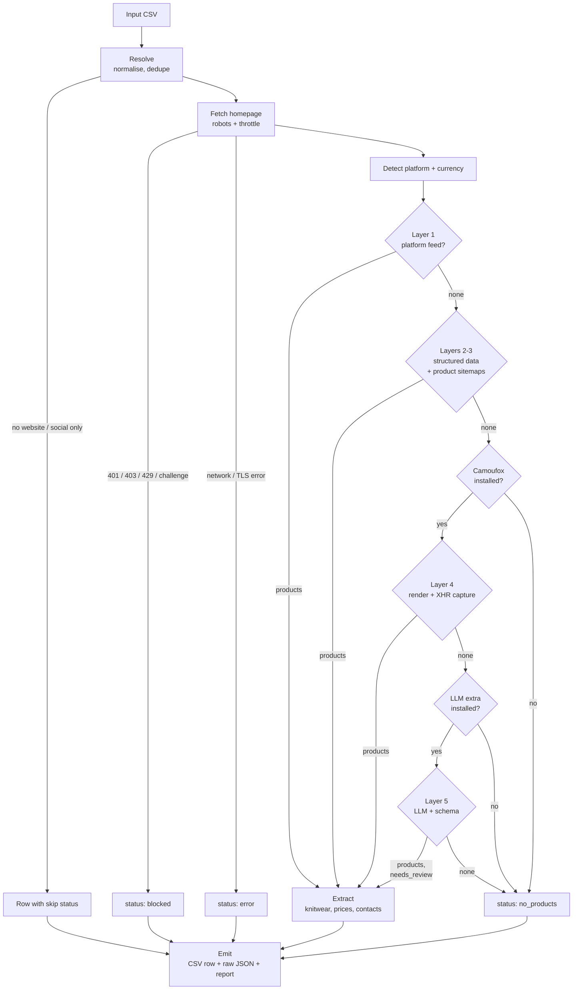

# Store Website Scraper v2 — Non-Shopify Coverage

**Date:** 2026-10-05
**Status:** Proposed
**Builds on:** [v1 design (2026-08-12)](2026-08-12-store-website-scraper-design.md)
**Decisions:** [ADR 0001](../decisions/0001-layered-acquisition-llm-last.md), [ADR 0002](../decisions/0002-camoufox-for-rendering-only.md)

---

## 1. Overview

`scrapebot` visits the websites of retail prospects and collects evidence for a
wholesale decision: **do they sell knitwear, at what price, and how do we contact
them?** It collects evidence only. A person decides whether a store is a good
prospect.

v1 works well for Shopify stores, because Shopify publishes a free product feed.
For every other platform, v1 reads only one kind of embedded data (JSON-LD). A
store that does not publish JSON-LD ends up with **zero products**, and the
output does not show the difference between "sells no knitwear" and "we could
not read the catalogue".

v2 adds more ways to read non-Shopify sites. They are tried in order from
cheapest and most accurate to most expensive. A headless browser and an LLM
are used only for the sites that the cheaper methods cannot read.

## 2. Background

### What v1 found

The reconnaissance run on 2026-08-12 (67 distinct store domains, Naples FL):

| Finding | Count |
|---|---|
| Shopify stores with an open `/products.json` feed | 26 |
| Products retrieved from those feeds, with prices | 6,167 |
| Non-Shopify sites needing HTML scraping (custom, Wix, WooCommerce, BigCommerce, Squarespace) | 41 |
| Homepage fetch failures | 5 |

Breakdown of the 5 failures:

- **3 were HTTP 403:** H&M, Macy's and Four Seasons. All three are national
  chains and are not wholesale prospects anyway.
- **2 were TLS handshake failures:** broken certificates, not bot detection.

**No real prospect was lost to bot detection.** The gap is coverage, not
blocking. Boutiques rarely run anti-bot protection. What they often lack is
machine-readable product data.

### Known v1 issues that v2 must fix

| # | Issue | Where | Effect |
|---|---|---|---|
| 1 | Failed fetches (timeouts, 429, 5xx) are written to the cache | `fetch.py`, `get()` | A re-run never retries a site that failed temporarily, unless `data/.cache` is deleted by hand |
| 2 | WooCommerce, Squarespace and BigCommerce sites with no JSON-LD get status `ok` with 0 products | `sources.py`, end of `acquire()` | A store whose catalogue we could not read looks like a store with no knitwear |
| 3 | Prices have no currency | `models.Product` | A browser sends `Accept-Language`, and Shopify Markets then localises prices to the requester's country (IDR was observed). The wrong currency would enter the price columns silently |
| 4 | Parts of the v1 spec were not built: OpenGraph price meta, depth-2 crawl, link-text prioritisation, parallel domains | `sources.py`, `extract.py` | Lower coverage than the spec assumed |
| 5 | The phone regex only matches US formats | `extract.py` | Phone column is empty outside the US |

### Where ScrapeGraphAI fits

ScrapeGraphAI (an open-source LLM scraping library) was evaluated. Its core idea
is **schema-driven extraction**: describe *what* to extract, not *where* it sits
in the HTML. That idea is adopted here, as the last acquisition layer. The
library itself is optional (see ADR 0001), for three reasons:

- `SmartScraperGraph` sends every chunk of a page to the LLM.
- It cannot produce a catalogue-wide `knit_share`.
- It would replace the Shopify feed, which is free and exact, with an LLM read
  of a few pages.

## 3. Goals and non-goals

### Goals

1. Read product titles, prices **and currency** from non-Shopify stores without
   writing selectors for individual sites.
2. Make every output row honest about how its data was obtained (`source_used`)
   and about how much to trust it (`needs_review`).
3. Spend money (browser time, LLM tokens) only on the sites that need it.
4. Fix v1 issues 1–3 before adding any new layer.
5. Keep the v1 guarantees:
   - Every input row produces exactly one output row.
   - All tests run offline.
   - Re-judging never requires re-scraping.

### Non-goals

- **Judging or scoring prospects.** The bot collects; people decide. (Unchanged from v1.)
- **Defeating anti-bot protection.** This means no solving of Cloudflare
  challenges or CAPTCHAs, no proxy rotation to escape bans, and no ignoring of
  `robots.txt`. A site that challenges or blocks us is recorded as `blocked`.
  See ADR 0002.
- **Logging in anywhere** or reading anything that is not public.
- **Discovering new stores.** The input list still comes from Google Places.
  Mining competitor "stockist" pages is a separate project.
- **Outreach, emailing or CRM integration.**
- **Full catalogue export.**

## 4. Tools

| Tool | Role | Status |
|---|---|---|
| `requests` | HTTP for layers 1–3, through the existing `Fetcher` | Existing |
| `beautifulsoup4` + `lxml` | HTML to text, link extraction | Existing |
| `extruct` | Reads JSON-LD, Microdata, OpenGraph and RDFa in one call | **New**, core |
| **Camoufox** | Anti-fingerprint Firefox with a Playwright-compatible API. Renders JavaScript sites and captures the JSON responses the page loads | **New**, optional extra |
| Anthropic SDK (Claude Haiku 4.5) | Schema-driven extraction from page text, for the last layer only | **New**, optional extra |
| ScrapeGraphAI | Alternative implementation of the LLM layer (`SmartScraperGraph` with `source=<html>`) | Optional, not the default |
| Botasaurus | Scraping framework with an anti-detect browser | **Rejected**: it duplicates the existing `Fetcher` (cache, retry, throttle), and its browser overlaps with Camoufox |
| Playwright-Chromium | Headless browser | **Rejected** in favour of Camoufox. Camoufox runs on Playwright, so its API is the same |
| `pytest` | Offline tests against saved fixtures | Existing |

## 5. Libraries and dependencies

Dependencies are split so a basic run stays light. A machine without a browser
or an API key still runs layers 1–3.

| File | Contents | Needed for |
|---|---|---|
| `requirements.txt` | existing pins + `extruct` | Every run, layers 1–3 |
| `requirements-browser.txt` | `camoufox[geoip]`, then run `camoufox fetch` once to download the browser | Layer 4 |
| `requirements-llm.txt` | `anthropic` | Layer 5 |
| `.env.example` | `ANTHROPIC_API_KEY=` (documented, left empty) | Layer 5 |

If an optional extra is not installed, its layer is skipped. The skip is
recorded in the run report; the run does not fail.

## 6. Acquisition layers

Layers run in order for each store. The run stops at the first layer that
yields products. Contact and about pages are always collected, whichever layer
produced the products.

| Layer | Technique | Cost | Typical platforms |
|---|---|---|---|
| **1. Platform feeds** | Shopify `/products.json` (v1) WooCommerce Store API `/wp-json/wc/store/v1/products` Squarespace `?format=json` Lightspeed eCom `?format=json` (to verify in the probe) | HTTP only | Shopify, WooCommerce, Squarespace, Lightspeed |
| **2. Embedded structured data** | JSON-LD (v1) Microdata OpenGraph `product:price:amount` App state in `<script>`: `__NEXT_DATA__`, `__NUXT__`, `window.__INITIAL_STATE__` | HTTP + parsing | BigCommerce, Magento, Wix product pages, Next.js/Nuxt shops |
| **3. Product sitemaps** | Wix `/store-products-sitemap.xml` Yoast `/product-sitemap.xml` WordPress `/wp-sitemap-posts-product-1.xml` Feeds the product URLs into layer 2 | HTTP + parsing | Wix, WordPress |
| **4. Browser render** | Camoufox renders the page, then layer 2 is re-run on the rendered HTML. JSON responses that look like products (they have price and title fields) are captured as the page loads | Seconds per page | JavaScript-only sites (`js_required`) |
| **5. LLM extraction** | Rendered page text plus a fixed schema go to the LLM. Every field must be supported by the page | Tokens | Sites with no structured data at all |

Layer-specific notes:

- **WooCommerce prices are in minor units.** `prices.price` is a string such as
  `"9800"`, and `prices.currency_minor_unit` says how many decimals it has.
- **Squarespace price fields differ between template versions.** Some give
  cents, some give a decimal `priceMoney.value`. The parser handles both.
- **The XHR capture in layer 4 keeps only JSON responses.** It stores the
  response URL with each product as evidence.
- **The LLM schema in layer 5** covers: `store_type`, `products[{title, price,
  currency, source_url}]`, `brands_carried`, `has_wholesale_page`. A product
  with no `source_url` on the visited pages is dropped. Every row from this
  layer gets `needs_review = True`.

## 7. Workflow

For each store in the input CSV:

1. **Resolve** (unchanged).
   - Normalise the URL and collapse `www.` duplicates.
   - Set aside rows with no website (`no_website`) or only a social link
     (`social_only`).
2. **Fetch the homepage** through `Fetcher`.
   - The `robots.txt` check and the 1.5 s per-domain delay apply to every
     request, including browser requests.
   - A 401, 403 or 429 response, or a recognised challenge page (Cloudflare
     "Just a moment…" / `cf-chl` markers), sets status `blocked` and stops.
3. **Detect the platform** from homepage markers (v1 `detect_platform`).
4. **Detect the currency** from the homepage:
   - Shopify's inline `Shopify.currency.active`, or `/meta.json` (to verify in Phase 0).
   - JSON-LD `priceCurrency`.
   - The platform feed's currency field.
5. **Layer 1:** try the feed that matches the detected platform, and fall back
   to trying all feeds if the platform is unknown. If it yields products, go to step 9.
6. **Layers 2–3:** sitemap or crawl as in v1, with priority pages first.
   Product sitemaps are added, and `extruct` and app-state parsing run on every
   page. If this yields products, go to step 9.
7. **Layer 4**, if Camoufox is installed and the site is `js_required` or has 0
   products: render the homepage and up to 10 priority or product pages with
   locale `en-US`, re-run layer 2, and capture product JSON. If this yields
   products, go to step 9.
8. **Layer 5**, if the LLM extra is installed and there are still 0 products:
   send the rendered page text with the schema. Set `needs_review = True`.
9. **Extract** (v1 functions, extended):
   - Knitwear matching and the price band, computed **within one currency only**.
   - Contacts, wholesale page, about snippet, chain flag.
10. **Emit:**
    - One CSV row per input row.
    - A raw JSON file with the layer trail and evidence URLs.
    - Coverage and cost lines in the run report.

### Flowchart

## 8. Final output

The same three artefacts as v1, with these additions.

### `data/out/<input>-enriched.csv`

New and changed columns:

| Column | Meaning |
|---|---|
| `currency` | ISO code of the prices in this row, for example `USD`. Empty if unknown |
| `currency_mixed` | `True` if the store's products came back in more than one currency. Price columns then use the majority currency only |
| `source_used` | Now one of: `shopify_feed`, `woocommerce_api`, `squarespace_json`, `structured_data`, `browser_render`, `browser_xhr`, `llm`, `none` |
| `layers_tried` | For example `1,2,3,4`. Shows how far down the ladder the store went |
| `needs_review` | `True` when products came from the LLM layer. A person checks these rows before acting on them |
| `scrape_status` | New value `no_products`: the site was readable, but no layer found a catalogue. It is no longer reported as `ok` |

All v1 columns are kept, with the same meaning: `knit_count`, `knit_share`,
`knit_examples`, `knit_price_min`/`max`, contacts, `wholesale_page`,
`about_snippet` and the rest.

### `data/raw/<domain>.json`

Adds:
- The layer trail, with the result of each layer.
- The detected currency and its source.
- For layer 4, the captured XHR URLs.
- For layer 5, the prompt version, the model, the token counts and the raw
  structured response.

### `data/out/run-report.md`

Adds:
- A **coverage table**: stores by `source_used`.
- The `no_products` list.
- The `needs_review` list.
- Layers that were skipped because an extra was not installed.
- LLM token totals for the run.

## 9. Plan

Each phase ends with a decision gate. A later phase only starts if the earlier
numbers justify it.

| Phase | Work | Exit / gate |
|---|---|---|
| **0. Fix v1** | Issue 1: do not cache network errors, 429 or 5xx. Issue 2: add `no_products`. Issue 3: add `Product.currency`, currency detection and the single-currency price band. Expose `Fetcher.allowed()` so the browser layer shares the robots check. | All existing tests pass. New tests cover each fix |
| **1. Probe** | Run a read-only probe over the ~41 non-Shopify sites. For each site, record which layer would succeed. Output a coverage matrix | Coverage matrix reviewed. It decides which of Phases 3 and 4 go ahead |
| **2. Layers 1–3** | WooCommerce and Squarespace feeds, `extruct`, app-state parsing, product sitemaps. Also the v1 spec gaps from issue 4 | Fixtures saved from real sites for each new parser. Coverage re-measured |
| **3. Layer 4** (gated) | Camoufox renderer behind an injectable interface, like `Fetcher.transport`. Rendered-HTML reuse and XHR capture | **Go only if** the probe shows at least 5 prospect sites that only a browser can read |
| **4. Layer 5** (gated) | LLM extractor behind an injectable interface. Schema, evidence rule, `needs_review`, token logging. Recorded LLM responses used as test fixtures | **Go only if** at least 5 prospect sites remain at `no_products` after Phase 3 |
| **5. Release** | Full run on the prospect list. Update the README ("How it gets the data"). Add `VERSION` (2.0.0) and `CHANGELOG.md` | Run report shows coverage per layer and the `needs_review` count |

The threshold of 5 sites is about 10% of the non-Shopify list. Below that
level, checking the remaining sites by hand costs less than building and
maintaining another layer.

### Testing approach

The v1 rule still holds: no test touches the network.

- Every new parser is tested against fixtures saved from real prospect sites.
- The browser and the LLM sit behind injectable interfaces, the same way
  `Fetcher` accepts a `transport`. Tests use fakes that return saved rendered
  HTML and saved LLM responses.

## 10. Conduct and data handling

- **Polite behaviour as in v1, now applied to the browser too:**
  - `robots.txt` respected.
  - 1.5 s delay per domain.
  - Public pages only.
  - No login.
- **Camoufox is used to render JavaScript.** Its realistic fingerprint stops a
  plain headless-browser flag from blocking normal page loads. It is not used
  to get past challenges. Challenge pages are detected and recorded as `blocked`.
- **Browser locale is fixed to `en-US`, and currency is always recorded.**
  Localised prices are then visible instead of silently wrong.
- **Only public page text is sent to the LLM.** The API key lives in `.env`,
  which is never committed.
- **Contacting stores is outside this tool.** Whether and how to contact the
  stores found this way is a commercial and CAN-SPAM decision for the operator,
  as stated in v1.

## 11. Conclusion

v1 already answers the question for Shopify stores, about 40% of the list,
exactly and for free. The rest of the list is not hard to *reach*: no prospect
was blocked. It is hard to *read*, because those sites do not publish a
product feed.

v2 closes that gap in layers, cheapest first:

- **Platform feeds and embedded structured data** (layers 1–3) are expected to
  recover most non-Shopify stores at no extra cost.
- **A browser** (layer 4) covers JavaScript-only sites.
- **An LLM** (layer 5, the ScrapeGraph technique) handles what is left, and
  every LLM row is flagged for review.

The probe in Phase 1 measures how many sites each layer actually recovers.
Layers 4 and 5 are built only if those numbers justify them.

Three principles do not change:

- The bot collects evidence and people judge.
- Every row says where its data came from.
- No access control is bypassed.
