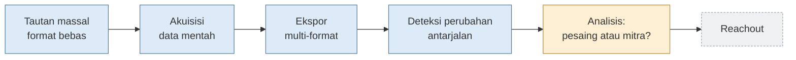

# PRD — Scrapebot: Pengumpulan Data Toko secara Massal

| | |
|---|---|
| **Versi** | 2.0 (draf) |
| **Tanggal** | 5 Oktober 2026 |
| **Status** | Draf untuk ditinjau |
| **Pemilik produk** | _(isi nama penanggung jawab)_ |
| **Menggantikan** | [PRD 1.0 (PDF)](../archive/pdf/prd-akuisisi-data-mentah-v1.pdf) |
| **Dokumen teknis** | [Arsitektur](../architecture/overview.md) · [Keputusan teknis](../decisions/) · [Standar rekayasa](../engineering/standards.md) · [Roadmap](../planning/roadmap.md) |

---

## 1. Ringkasan

Operator menempelkan atau mengunggah daftar tautan toko dalam jumlah banyak, dalam
format apa pun. Scrapebot mengunjungi setiap toko, mengumpulkan data produk, harga,
merek yang dijual, halaman grosir, dan kontak **apa adanya**, lalu mengekspornya ke
format yang dipilih operator (Excel, Parquet, JSON, basis data, Google Sheets, dan
lainnya). Data ini menjadi bahan untuk tahap berikutnya: **menentukan toko mana yang
pesaing dan toko mana yang layak diajak bekerja sama**. Penjangkauan (reachout)
dikerjakan belakangan.

Bot bisa dipakai lewat antarmuka web sederhana yang mirip *playground* ScrapeGraph,
tetapi menerima banyak tautan sekaligus, atau lewat baris perintah (CLI).

## 2. Masalah dan hasil bisnis

**Masalah sekarang:**

1. Riset toko dilakukan satu per satu secara manual, sehingga lambat dan hasilnya tidak
   seragam.
2. Versi 1 hanya membaca toko Shopify dengan baik. Toko di platform lain sering
   menghasilkan nol produk.
3. Masukan dan keluaran terikat pada CSV dengan kolom tetap.
4. Versi 1 dirancang untuk satu wilayah (Amerika Serikat), tanpa pilihan negara dan
   bahasa.

**Hasil bisnis yang dituju:**

| Hasil | Ukuran |
|---|---|
| Waktu riset turun | Waktu dari "daftar tautan siap" sampai "data siap dianalisis". Target ditetapkan setelah mengukur proses manual sekarang ([P-01](#15-asumsi-dan-pertanyaan-terbuka)) |
| Cakupan naik | Persentase toko non-Shopify yang menghasilkan data produk |
| Keputusan lebih cepat | Data sudah memuat sinyal untuk memilah pesaing dan calon mitra |
| Dipakai tim | Jumlah run per bulan oleh tim, bukan hanya oleh pembuatnya |

## 3. Tujuan akhir dan batas PRD ini



| Bagian | Status di PRD ini |
|---|---|
| Masukan massal, akuisisi, ekspor, deteksi perubahan | **Dalam cakupan** |
| Analisis pesaing atau mitra | **Fase berikutnya**, dengan PRD sendiri. PRD ini wajib menyediakan datanya ([bagian 8.3](#83-data-yang-wajib-tersedia-untuk-analisis-berikutnya)) |
| Reachout (surel, CRM) | **Belakangan**, di luar cakupan |

## 4. Pengguna

| Pengguna | Kebutuhan | Cara memakai |
|---|---|---|
| **Operator** | Menjalankan bot untuk ratusan tautan tanpa menulis kode | Antarmuka web: tempel tautan, pilih wilayah, model LLM, dan format, lalu klik Jalankan |
| **Analis** | Data yang rapi, lengkap, dan dapat ditelusuri asalnya | Membuka hasil di Excel, Google Sheets, DuckDB, pandas, atau alat BI |
| **Peninjau** | Tahu data mana yang perlu dicek manusia | Menyaring baris `needs_review` dan status `no_products` atau `blocked` |
| **Otomasi** (n8n, cron) | Menjalankan bot tanpa antarmuka | CLI dengan berkas konfigurasi yang sama |

### Skenario utama

1. Operator membuka antarmuka web dan menempelkan 300 tautan dari berbagai sumber.
   Sebagian berupa beranda, sebagian halaman produk, sebagian bercampur dengan teks lain.
2. Operator memilih wilayah **Amerika Serikat**, bahasa **Inggris**, penyedia LLM
   **Gemini**, lalu memasukkan API key-nya.
3. Operator memilih format **Excel + Parquet**.
4. **Mode uji** aktif secara bawaan: bot menjalankan 2 tautan pertama dari awal sampai
   akhir. Operator memeriksa hasilnya.
5. Operator menjalankan sisanya. Progres tampil per toko.
6. Operator mengunduh berkas hasil. Laporan run menunjukkan: masuk = diproses +
   dilewati, cakupan per sumber, dan biaya token.
7. Sebulan kemudian, run yang sama diulang. Bot menandai produk baru, produk hilang,
   dan perubahan harga.

## 5. Ruang lingkup

### 5.1 Dalam cakupan

- Masukan massal dalam format bebas, lewat antarmuka web atau CLI.
- Pilihan wilayah dan bahasa. Bawaannya Amerika Serikat dan bahasa Inggris.
- Akuisisi berlapis: umpan platform, data terstruktur, sitemap, render peramban
  (bersyarat), dan LLM.
- LLM multi-penyedia: cukup isi API key, lalu pilih model.
- Data mentah: produk, merek, harga apa adanya, halaman grosir dan stockist, teks
  halaman, dan kontak sebagaimana ditemukan.
- Ekspor ke banyak format sekaligus.
- Deteksi perubahan antarjalan.
- Mode uji (LIMIT), laporan run, dan rekonsiliasi jumlah.

### 5.2 Di luar cakupan

| Hal | Alasan |
|---|---|
| Penyimpanan atau ekspor **HTML** | Tidak diperlukan untuk analisis. Yang disimpan adalah teks halaman dan data terstruktur |
| Klasifikasi pesaing atau mitra | Fase berikutnya. Datanya disiapkan di PRD ini |
| Reachout, pengiriman surel, CRM | Belakangan |
| Menembus perlindungan antibot | Tidak ada pemecah CAPTCHA, tidak ada rotasi proksi, dan `robots.txt` dipatuhi ([ADR 0002](../decisions/0002-camoufox-for-rendering-only.md)) |
| Login ke situs | Hanya halaman publik |
| Mencari toko baru secara otomatis | Daftar tautan berasal dari operator |
| Antarmuka multi-pengguna dengan akun dan hak akses | Antarmuka v2 adalah alat internal yang dijalankan lokal |

## 6. Antarmuka pengguna

Antarmuka web internal yang dibangun dengan **TypeScript** (React + Vite) di atas
layanan API lokal (FastAPI), dan dijalankan lokal
([ADR 0007](../decisions/0007-typescript-web-ui-local-api.md)). Logikanya sama dengan CLI;
antarmuka hanya membaca dan menulis konfigurasi.

```
┌───────────────────────┬────────────────────────────────────────────────────┐
│ PENGATURAN            │  Tautan toko                                       │
│                       │  ┌──────────────────────────────────────────────┐  │
│ Wilayah   [AS     ▾]  │  │ tempel tautan atau teks apa pun di sini...   │  │
│ Bahasa    [Inggris▾]  │  └──────────────────────────────────────────────┘  │
│ Mata uang [otomatis]  │  atau unggah berkas: .txt .csv .tsv .xlsx .json    │
│                       │                      .jsonl .parquet               │
│ LLM                   │                                                    │
│ Penyedia  [Gemini ▾]  │  Terdeteksi: 300 tautan · 287 domain unik ·        │
│ Model     [.......]   │              13 duplikat                           │
│ API key   [••••••]    │                                                    │
│ [Tes koneksi]         │  [ ] Mode uji (2 tautan pertama)   [ Jalankan ]    │
│ Batas biaya [$5   ]   │                                                    │
│                       │  Progres ─────────────────────────────  112 / 287  │
│ Keluaran              │  domain              status   sumber      produk   │
│ [x] Excel  [x] Parquet│  butik-a.com         ok       shopify_feed   214   │
│ [ ] CSV    [ ] JSONL  │  butik-b.com         ok       llm             18 ⚑ │
│ [ ] SQLite [ ] DuckDB │  butik-c.com         blocked  —                0   │
│ [ ] Sheets [ ] Postgres│                                                   │
│                       │  [Unduh Excel] [Unduh Parquet] [Laporan run]       │
└───────────────────────┴────────────────────────────────────────────────────┘
⚑ = needs_review
```

## 7. Kebutuhan fungsional

Prioritas:
- **Wajib**: harus ada untuk rilis.
- **Sebaiknya**: dikerjakan bila waktu memungkinkan.
- **Bersyarat**: dibangun hanya bila survei M1 membuktikan kebutuhannya.

### 7.1 Masukan

| ID | Kebutuhan | Prioritas | Kriteria penerimaan |
|---|---|---|---|
| IN-01 | Menerima tautan yang ditempel sebagai teks bebas. URL diekstrak dari teks apa pun, termasuk teks yang bercampur kalimat | Wajib | Teks berisi 10 URL di tengah kalimat menghasilkan 10 URL |
| IN-02 | Menerima unggahan berkas `.txt`, `.csv`, `.tsv`, `.xlsx`, `.json`, `.jsonl`, `.parquet` | Wajib | Daftar yang sama dalam ketujuh format menghasilkan daftar URL yang identik |
| IN-03 | Pada berkas bertabel, kolom URL dikenali otomatis dan dapat dipilih manual. Kolom lain diteruskan utuh sebagai metadata masukan | Wajib | Kolom `store_name`, `address`, dan lainnya muncul di keluaran tanpa perubahan |
| IN-04 | Deduplikasi per domain terdaftar (misalnya `www.a.com` dan `a.com/shop` dihitung satu toko) | Wajib | Ringkasan menampilkan jumlah tautan, domain unik, dan duplikat sebelum run |
| IN-05 | Tautan dalam (halaman produk atau koleksi) menandai tokonya dan halaman itu ikut diambil sebagai halaman prioritas | Wajib | Tautan produk menghasilkan data toko lengkap plus produk tersebut |
| IN-06 | Tautan media sosial, marketplace (Amazon, Etsy), dan tautan rusak ditandai, bukan diam-diam dibuang | Wajib | Status `social_only`, `marketplace`, atau `invalid_url` dengan tautan aslinya |
| IN-07 | Batas jumlah tautan per run dapat diatur (bawaan 1.000) | Wajib | Masukan di atas batas ditolak dengan pesan jelas sebelum run dimulai |
| IN-08 | Masukan dari tautan Google Sheets | Sebaiknya | Daftar terbaca tanpa ekspor manual |
| IN-09 | Kolom `country` atau `language` pada masukan mengganti pengaturan wilayah untuk baris itu | Sebaiknya | Daftar campuran AS dan Inggris diproses dengan wilayah masing-masing |

### 7.2 Wilayah dan bahasa

| ID | Kebutuhan | Prioritas | Kriteria penerimaan |
|---|---|---|---|
| RG-01 | Pilihan negara dari daftar ISO 3166 (`pycountry`). Bawaan: Amerika Serikat | Wajib | Semua negara tersedia; kode tidak valid ditolak |
| RG-02 | Pilihan bahasa dari ISO 639 (`pycountry`). Bawaan mengikuti negara | Wajib | Memilih Jerman menyarankan bahasa Jerman |
| RG-03 | Mata uang yang diharapkan mengikuti negara (`babel`), dan dapat diganti manual | Wajib | Memilih Kanada menyarankan CAD |
| RG-04 | Lokal dan zona waktu peramban mengikuti wilayah yang dipilih | Bersyarat (ikut M4) | Toko dengan harga per wilayah menampilkan harga pasar asalnya |
| RG-05 | Nomor telepon diurai dengan wilayah bawaan yang dipilih (`phonenumbers`) | Wajib | Nomor Inggris tanpa kode negara terbaca benar saat wilayah Inggris |
| RG-06 | Bahasa halaman dideteksi dan dicatat (`lingua-language-detector`) | Sebaiknya | Setiap halaman punya kode bahasa terdeteksi |
| RG-07 | Header `Accept-Language` tetap tidak dikirim pada HTTP | Wajib | Harga tidak dilokalkan ke negara operator |

### 7.3 Akuisisi

| ID | Kebutuhan | Prioritas | Kriteria penerimaan |
|---|---|---|---|
| AQ-01 | Pengambilan sopan: `robots.txt`, jeda per domain (bawaan 1,5 detik), coba ulang bertahap | Wajib | Tes membuktikan URL terlarang tidak diambil dan jeda dijaga |
| AQ-02 | Hanya respons berhasil yang disimpan di cache | Wajib | Run ulang mencoba lagi toko yang gagal sementara |
| AQ-03 | Deteksi pemblokiran: 401, 403, 429, dan halaman tantangan | Wajib | Status `blocked`; tidak ada upaya penembusan |
| AQ-04 | Deteksi platform dan mata uang beserta sumbernya | Wajib | Tercatat untuk setiap toko yang berandanya terbaca |
| AQ-05 | Umpan platform: Shopify, WooCommerce, Squarespace | Wajib | Fixture dari situs nyata lulus tes |
| AQ-06 | Umpan Lightspeed dan platform lain yang ditemukan saat survei | Sebaiknya | Ditambahkan bila survei menunjukkan endpoint bekerja |
| AQ-07 | Discovery: sitemap (termasuk sitemap produk) dan tautan internal sampai kedalaman 2, maksimal 25 halaman per toko | Wajib | Halaman kontak, "tentang kami", grosir, dan stockist selalu masuk anggaran |
| AQ-08 | Data terstruktur: JSON-LD, Microdata, OpenGraph, RDFa, state aplikasi | Wajib | Setiap format punya fixture yang lulus tes |
| AQ-09 | Render peramban (Camoufox) dan tangkap XHR JSON, maksimal 10 halaman per toko | Bersyarat | Dibangun bila survei menemukan ≥ 5 toko yang hanya terbaca dengan peramban |
| AQ-10 | Status `no_products` untuk situs terbaca tanpa katalog | Wajib | Tidak ada toko berstatus `ok` dengan nol produk |
| AQ-11 | Beberapa domain diproses paralel tanpa melanggar jeda per domain | Wajib | 300 domain selesai dalam target waktu ([bagian 9](#9-kebutuhan-nonfungsional)) |

### 7.4 LLM multi-penyedia

| ID | Kebutuhan | Prioritas | Kriteria penerimaan |
|---|---|---|---|
| LM-01 | Satu antarmuka untuk semua penyedia melalui **LiteLLM**, dengan keluaran terstruktur melalui **instructor** + Pydantic ([ADR 0004](../decisions/0004-llm-gateway-litellm-instructor.md)) | Wajib | Mengganti penyedia hanya mengubah konfigurasi |
| LM-02 | Penyedia yang disiapkan: OpenAI (GPT), Google Gemini, Anthropic Claude, Mistral, Groq, OpenRouter, Azure OpenAI, dan Ollama lokal | Wajib | Setiap penyedia lulus tes kontrak dengan respons rekaman |
| LM-03 | Model ditulis bebas dalam format `penyedia/model` | Wajib | Model baru dapat dipakai tanpa perubahan kode |
| LM-04 | API key dimasukkan di antarmuka (hanya disimpan di memori sesi) atau dibaca dari `.env` | Wajib | Key tidak pernah muncul di log, berkas keluaran, laporan, atau cache |
| LM-05 | Tombol "Tes koneksi" memvalidasi key dan model sebelum run | Wajib | Key salah memberi pesan jelas, bukan galat mentah |
| LM-06 | LLM hanya dipanggil untuk toko yang masih nol produk setelah lapisan lain | Wajib | Laporan menunjukkan jumlah toko yang memakai LLM |
| LM-07 | Aturan bukti: produk tanpa URL bukti dari halaman yang dikirim dibuang | Wajib | Tes dengan respons rekaman yang berisi produk karangan |
| LM-08 | Setiap hasil LLM bertanda `needs_review` dan memiliki `confidence` | Wajib | Kolom tersedia di semua format keluaran |
| LM-09 | Batas biaya per run. LLM berhenti dipanggil saat batas tercapai | Wajib | Laporan mencatat titik berhenti dan sisa toko |
| LM-10 | Urutan cadangan penyedia (misalnya Gemini, lalu GPT, lalu Ollama) bila penyedia utama gagal | Sebaiknya | Kegagalan satu penyedia tidak menghentikan run |
| LM-11 | Token, biaya, model, dan versi prompt dicatat per panggilan | Wajib | Total biaya per run tampil di laporan |

### 7.5 Data mentah

| ID | Kebutuhan | Prioritas | Kriteria penerimaan |
|---|---|---|---|
| DT-01 | Produk disimpan apa adanya: judul, harga mentah, mata uang, merek atau vendor, jenis produk, tag, URL, sumber, URL bukti, dan objek sumber utuh | Wajib | Tidak ada konversi atau pembersihan nilai |
| DT-02 | Teks halaman disimpan utuh, **tanpa HTML** | Wajib | Tidak ada berkas atau kolom HTML di keluaran |
| DT-03 | Kontak sebagaimana ditemukan: surel, telepon, Instagram, Facebook, TikTok, LinkedIn, beserta URL halaman sumbernya | Wajib | Setiap kontak punya `source_url` |
| DT-04 | Halaman grosir, stockist, dan "tentang kami" ditandai jenisnya | Wajib | Kolom `page_kind` terisi |
| DT-05 | Setiap catatan membawa `run_id`, waktu ambil, dan tahap sumbernya | Wajib | Semua tabel bisa digabung per run |

### 7.6 Keluaran

| ID | Kebutuhan | Prioritas | Kriteria penerimaan |
|---|---|---|---|
| OUT-01 | Data disusun sebagai tabel rapi yang saling terhubung ([bagian 8](#8-model-data)) | Wajib | Kunci penghubung konsisten di semua format |
| OUT-02 | Format berkas: JSON, JSONL, CSV, TSV, Excel `.xlsx` (satu sheet per tabel), Parquet | Wajib | Isi semua format identik pada run yang sama |
| OUT-03 | Basis data lokal: SQLite dan DuckDB | Wajib | Dapat dikueri langsung tanpa impor |
| OUT-04 | Google Sheets: satu tab baru per run, tidak pernah menimpa tab lama | Sebaiknya | Sheet tim tidak berubah selain tab baru |
| OUT-05 | PostgreSQL: append dengan `run_id`, tanpa menghapus data lama | Sebaiknya | Run kedua menambah, bukan menimpa |
| OUT-06 | Beberapa format aktif sekaligus dalam satu run | Wajib | Memilih Excel + Parquet + SQLite menghasilkan ketiganya |
| OUT-07 | Semua berkas dapat diunduh dari antarmuka | Wajib | Tombol unduh per format |
| OUT-08 | Menambah format baru cukup dengan menambah satu adapter | Wajib | Tidak ada perubahan pada tahap akuisisi |

### 7.7 Deteksi perubahan antarjalan

| ID | Kebutuhan | Prioritas | Kriteria penerimaan |
|---|---|---|---|
| CH-01 | Setiap run memiliki `run_id` dan disimpan sebagai snapshot | Wajib | Run lama tetap dapat dibaca |
| CH-02 | Membandingkan run dengan run sebelumnya untuk domain yang sama: produk baru, produk hilang, perubahan harga, perubahan status | Sebaiknya | Tabel `changes` terisi pada run kedua |
| CH-03 | Ringkasan perubahan tampil di laporan run | Sebaiknya | Jumlah perubahan per jenis |

### 7.8 Operasional

| ID | Kebutuhan | Prioritas | Kriteria penerimaan |
|---|---|---|---|
| OP-01 | **Mode uji (LIMIT)**: jalankan N tautan pertama (bawaan 2) dari awal sampai akhir sebelum run penuh. Aktif secara bawaan di antarmuka | Wajib | Run penuh tidak dapat dimulai di antarmuka sebelum mode uji pernah dijalankan untuk masukan itu, kecuali dimatikan dengan sengaja |
| OP-02 | Laporan run: rekonsiliasi (masuk = diproses + dilewati), jumlah per status, cakupan per sumber, daftar `needs_review` dan `no_products`, durasi, dan biaya | Wajib | Angka rekonsiliasi selalu cocok |
| OP-03 | Run dapat dilanjutkan setelah terhenti tanpa mengulang toko yang sudah selesai | Wajib | Menghentikan run di tengah lalu melanjutkannya menghasilkan data yang sama |
| OP-04 | CLI dan antarmuka memakai konfigurasi dan kode yang sama | Wajib | Konfigurasi yang diekspor dari antarmuka dapat dijalankan lewat CLI |
| OP-05 | Konfigurasi run dapat disimpan dan dimuat ulang | Sebaiknya | Run bulanan memakai preset yang sama |

## 8. Model data

### 8.1 Tabel

Semua format keluaran dibentuk dari tabel yang sama
([ADR 0006](../decisions/0006-tidy-tables-multiformat-writers.md)).

| Tabel | Satu baris per | Kolom kunci |
|---|---|---|
| `runs` | run | `run_id`, waktu mulai dan selesai, konfigurasi (tanpa key), versi, total biaya |
| `inputs` | baris masukan | `run_id`, `input_id`, tautan asli, `domain`, status, metadata masukan |
| `stores` | toko per run | `run_id`, `domain`, status, platform, negara, bahasa, mata uang, `layers_tried`, `product_count`, `ssl_bypassed` |
| `products` | produk | `run_id`, `domain`, `title`, `price_raw`, `currency`, `vendor`, `product_type`, `tags`, `url`, `source`, `evidence_url`, `needs_review`, `confidence`, `raw` (JSON) |
| `pages` | halaman yang diambil | `run_id`, `domain`, `url`, `page_kind`, `http_status`, `via`, `language`, `text` |
| `contacts` | kontak yang ditemukan | `run_id`, `domain`, `type`, `value`, `source_url` |
| `changes` | perubahan antarjalan | `run_id`, `domain`, `change_type`, `key`, nilai lama, nilai baru |

Pada format datar (CSV, TSV, Excel), kolom bertingkat seperti `raw` dan `tags`
disimpan sebagai teks JSON. Pada JSON dan JSONL, strukturnya tetap utuh.

### 8.2 Status

| Status | Arti |
|---|---|
| `ok` | Minimal satu produk ditemukan |
| `no_products` | Situs terbaca, tetapi tidak ada lapisan yang menemukan katalog |
| `js_required` | Perlu peramban yang belum terpasang atau belum dibangun |
| `blocked` | 401, 403, 429, atau halaman tantangan. Tidak ditembus |
| `error` | Galat jaringan, galat HTTP lain, atau dilarang `robots.txt` |
| `social_only`, `marketplace`, `invalid_url`, `duplicate` | Dilewati saat masukan, dengan alasan tercatat |

### 8.3 Data yang wajib tersedia untuk analisis berikutnya

Analisis pesaing atau mitra belum dibangun di PRD ini, tetapi datanya harus sudah ada.

| Pertanyaan analisis | Data pendukung |
|---|---|
| Toko ini menjual merek sendiri (calon **pesaing**) atau banyak merek (calon **mitra**)? | `products.vendor`, jumlah vendor unik, teks "tentang kami" |
| Apakah mereka menjual rajutan, dan seberapa banyak? | `products.title`, `product_type`, `tags` |
| Apakah rentang harganya cocok dengan kita? | `price_raw` + `currency` |
| Apakah mereka menerima merek dari luar? | Halaman grosir atau stockist (`page_kind`) |
| Bagaimana cara menghubungi mereka? | Tabel `contacts` |
| Apakah mereka berubah dari waktu ke waktu? | Tabel `changes` |

## 9. Kebutuhan nonfungsional

| Aspek | Kebutuhan |
|---|---|
| **Etika** | `robots.txt` dipatuhi untuk HTTP dan peramban. Jeda per domain. Hanya halaman publik. Tanpa penembusan antibot |
| **Keamanan** | API key hanya di memori sesi atau `.env`, tidak pernah di log, keluaran, atau repositori. DSN basis data dari variabel lingkungan |
| **Kinerja** | Target usulan: 300 domain dalam ≤ 60 menit tanpa peramban dan LLM, dengan pemrosesan paralel antardomain. Dikonfirmasi saat M1 |
| **Keandalan** | Satu toko yang gagal tidak menghentikan run. Setiap toko selalu mendapat status |
| **Ketertelusuran** | Setiap produk punya sumber dan URL bukti. Setiap run punya konfigurasi dan versi yang tercatat |
| **Biaya** | Biaya LLM dicatat per panggilan dan dibatasi per run |
| **Pengujian** | Semua tes berjalan tanpa jaringan dengan respons HTTP dan LLM yang direkam |
| **Portabilitas** | Tanpa peramban atau API key, lapisan lain tetap berjalan dan yang dilewati tercatat |
| **Kualitas kode** | Mengikuti [standar rekayasa](../engineering/standards.md) |

## 10. Beli atau bangun

| Pilihan | Model biaya | Kecocokan | Kontrol data | Catatan |
|---|---|---|---|---|
| ScrapeGraph API | Berbayar per permintaan | Satu URL per panggilan, semua lewat LLM | Data lewat pihak ketiga | Mengganti umpan Shopify yang gratis dan tepat dengan pembacaan LLM |
| Firecrawl (hosted) | Berbayar per kredit | Kuat untuk crawl dan ekstraksi | Data lewat pihak ketiga | Tetap perlu logika umpan dan status sendiri |
| Apify actors | Berbayar per pemakaian | Ada actor siap pakai untuk Shopify | Data lewat pihak ketiga | Satu actor per platform, perlu dirangkai |
| **Bangun sendiri (v1 diperluas)** | Gratis, kecuali token LLM | Umpan gratis menutup ±40% toko; LLM hanya untuk sisanya | Penuh | v1 sudah berjalan dan teruji |

**Rekomendasi:** bangun sendiri di atas v1. Pustaka sumber terbuka ScrapeGraphAI
dan Crawl4AI tetap dipakai sebagai pembanding dalam benchmark M1. Harga layanan
berbayar tidak dibandingkan di sini karena berubah-ubah; bila perlu, uji coba 30 hari
pada satu layanan dengan volume kita.

## 11. Pilihan teknologi

Rincian dan alasannya ada di [arsitektur](../architecture/overview.md) dan
[keputusan teknis](../decisions/).

| Bagian | Pilihan |
|---|---|
| Antarmuka | React + TypeScript (Vite) + FastAPI lokal + CLI |
| Masukan | `pandas`, `openpyxl`, `pyarrow`, `urlextract`, `tldextract` |
| Wilayah dan bahasa | `pycountry`, `babel`, `phonenumbers`, `lingua-language-detector` |
| HTTP | `httpx`, `hishel`, `tenacity`, `aiolimiter`, `protego` |
| Ekstraksi | `extruct`, `chompjs`, `selectolax`, `trafilatura`, `ultimate-sitemap-parser` |
| Peramban | Camoufox (bersyarat) |
| LLM | LiteLLM + instructor + Pydantic |
| Keluaran | `pandas`, `pyarrow`, `openpyxl`, `duckdb`, SQLAlchemy, `gspread` |
| Konfigurasi | `pydantic-settings` + YAML |

## 12. Rencana rilis

Setiap tahap diakhiri dengan **run LIMIT pada 2 toko**, lalu run penuh, lalu
verifikasi hasil nyata (bukan hanya kode keluar 0).

| Tahap | Isi | Gerbang selesai |
|---|---|---|
| **M0. Fondasi** | Perbaikan v1 (cache galat, `no_products`, mata uang), model data (bagian 8), adapter masukan IN-01 sampai IN-07, keluaran OUT-01 sampai OUT-03 dan OUT-06, mode uji OP-01, laporan OP-02 | Semua tes lulus; daftar v1 menghasilkan data yang setara dalam semua format |
| **M1. Survei dan benchmark** | Run baca-saja atas toko non-Shopify; gold set 20 situs; benchmark penyedia LLM dan pustaka ekstraksi | Matriks cakupan dan hasil benchmark ditinjau; memutuskan AQ-09 |
| **M2. Akuisisi non-Shopify** | AQ-05 sampai AQ-08, AQ-10, AQ-11 | Cakupan non-Shopify diukur ulang terhadap target |
| **M3. LLM dan antarmuka** | LM-01 sampai LM-11, antarmuka web TypeScript (bagian 6), OUT-07 | Operator nonteknis menyelesaikan skenario utama tanpa bantuan |
| **M4. Render** (bersyarat) | AQ-09, RG-04 | Hanya bila M1 menemukan ≥ 5 toko yang hanya terbaca dengan peramban |
| **M5. Global dan perubahan** | RG-01 sampai RG-07, IN-08, IN-09, CH-01 sampai CH-03, OUT-04, OUT-05 | Daftar campuran dua negara dan run kedua menghasilkan tabel `changes` |
| **M6. Rilis dan serah terima** | Run penuh pada daftar nyata; dokumen serah terima (bagian 14) | Semua metrik mutlak terpenuhi; tim menjalankan satu run sendiri |

## 13. Metrik keberhasilan

Metrik **mutlak** wajib dipenuhi untuk rilis. Metrik **usulan** dikonfirmasi setelah M1.

| Metrik | Target | Jenis |
|---|---|---|
| Rekonsiliasi: tautan masuk = diproses + dilewati | 100% run | Mutlak |
| Toko berstatus `ok` dengan nol produk | 0 | Mutlak |
| Produk dengan sumber dan URL bukti | 100% | Mutlak |
| API key yang bocor ke log atau keluaran | 0 | Mutlak |
| Permintaan yang melanggar `robots.txt` atau menembus tantangan | 0 | Mutlak |
| Toko non-Shopify yang menghasilkan ≥ 1 produk | ≥ 60% | Usulan |
| Ketepatan produk hasil LLM pada gold set | ≥ 90% | Usulan |
| Durasi 300 domain tanpa peramban dan LLM | ≤ 60 menit | Usulan |
| Run per bulan oleh tim (adopsi) | ≥ 2 | Usulan |

## 14. Serah terima

Rilis dianggap selesai bila lima dokumen berikut ada di `docs/operations/`:

1. **Apa yang dilakukan bot**: satu paragraf bahasa sehari-hari.
2. **Cara menjalankan**: antarmuka dan CLI, masukan, lokasi keluaran.
3. **Cara memeriksa hasilnya**: dua sampai tiga pengecekan, termasuk rekonsiliasi.
4. **Tiga kegagalan teratas dan perbaikannya**.
5. **Pemilik dan catatan pemeliharaan**: apa yang perlu diperbarui saat platform atau
   penyedia LLM berubah.

## 15. Asumsi dan pertanyaan terbuka

### Asumsi

- **A-01.** Antarmuka dipakai internal oleh satu sampai beberapa orang, dijalankan lokal.
- **A-02.** "Massal" berarti sampai 1.000 tautan per run untuk sementara.
- **A-03.** "HTML tidak perlu" berarti HTML tidak disimpan dan tidak diekspor. Teks
  halaman tetap disimpan.
- **A-04.** "Bot bisa membantu perubahan" diartikan sebagai **deteksi perubahan
  antarjalan** (CH-01 sampai CH-03).
- **A-05.** Fokus wilayah adalah Amerika Serikat. Wilayah lain didukung lewat
  pengaturan, tetapi diuji setelah AS stabil.

### Pertanyaan terbuka

| No. | Pertanyaan | Pengaruhnya |
|---|---|---|
| P-01 | Berapa lama riset manual per toko sekarang? | Menjadi dasar target "waktu riset turun" |
| P-02 | Apakah A-04 sudah tepat, atau maksudnya hal lain? | Ruang lingkup CH-01 sampai CH-03 |
| P-03 | Siapa pemilik bot setelah serah terima? | Bagian 14, butir 5 |
| P-04 | Apakah Google Sheets tim menjadi tujuan utama keluaran? | Prioritas OUT-04 bisa naik menjadi Wajib |
| P-05 | Penyedia LLM mana yang sudah punya akun dan key? | Urutan pengujian LM-02 |
| P-06 | Negara mana yang menyusul setelah AS? | Urutan pengujian RG-01 sampai RG-07 |

## 16. Glosarium

| Istilah | Arti |
|---|---|
| Adapter | Komponen yang dapat ditukar untuk satu tugas, misalnya membaca Excel atau menulis ke PostgreSQL |
| Data mentah | Data yang disimpan persis seperti ditemukan, ditambah keterangan asalnya |
| Gold set | Kumpulan situs yang jawabannya diperiksa manual, untuk benchmark |
| JSONL | Satu objek JSON per baris; lentur dan mudah diproses bertahap |
| Mode uji (LIMIT) | Menjalankan beberapa tautan pertama dari awal sampai akhir sebelum run penuh |
| Run | Satu kali eksekusi bot atas satu daftar tautan |
| Umpan produk | Alamat yang disediakan platform toko untuk daftar produk dalam JSON |
| URL bukti | Alamat halaman atau respons tempat sebuah data ditemukan |
| `needs_review` | Penanda bahwa data perlu diperiksa manusia sebelum dipakai |
