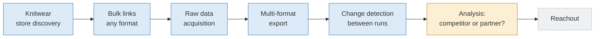

# PRD — Scrapebot: Bulk Store Data Collection

| | |
|---|---|
| **Version** | 2.1 (draft) |
| **Date** | 7 October 2026 (2.1: store discovery and knitwear focus, [ADR 0008](../decisions/0008-store-discovery-paid-search.md)) |
| **Status** | Draft for review |
| **Product owner** | _(fill in the owner's name)_ |
| **Supersedes** | [PRD 1.0 (PDF)](../archive/pdf/prd-akuisisi-data-mentah-v1.pdf) |
| **Technical documents** | [Architecture](../architecture/overview.md) · [Technical decisions](../decisions/) · [Engineering standards](../engineering/standards.md) · [Roadmap](../planning/roadmap.md) |

---

## 1. Summary

Scrapebot finds knitwear stores through Google Maps, web search, Instagram and
Facebook profiles in search results, and an LLM that searches the web. The result is
a list of store links. The operator can also paste or upload their own list of links,
in bulk and in any format. Scrapebot visits each store, collects product data, prices,
the brands sold, wholesale pages and contacts **as they are**, then exports them to
the formats the operator picks (Excel, Parquet, JSON, databases, Google Sheets and
more). This data feeds the next stage: **deciding which stores are competitors and
which are worth partnering with**. Reachout comes later.

The bot can be used through a simple web interface similar to the ScrapeGraph
*playground*, but one that accepts many links at once, or through the command line
(CLI).

## 2. Problem and business outcomes

**Problems today:**

1. Store research is done manually, one store at a time, so it is slow and the
   results are not uniform.
2. Version 1 only reads Shopify stores well. Stores on other platforms often yield
   zero products.
3. Input and output are tied to CSV with fixed columns.
4. Version 1 was designed for one region (the United States), with no choice of
   country or language.

**Target business outcomes:**

| Outcome | Measure |
|---|---|
| Less research time | Time from "link list ready" to "data ready for analysis". The target is set after measuring today's manual process ([P-01](#15-assumptions-and-open-questions)) |
| Wider coverage | Percentage of non-Shopify stores that yield product data |
| Faster decisions | The data already holds the signals to sort competitors from potential partners |
| Used by the team | Runs per month by the team, not only by its author |

## 3. End goal and the boundary of this PRD



| Part | Status in this PRD |
|---|---|
| Store discovery, bulk input, acquisition, export, change detection | **In scope** |
| Competitor or partner analysis | **Next phase**, with its own PRD. This PRD must provide its data ([section 8.3](#83-data-required-for-the-next-analysis)) |
| Reachout (email, CRM) | **Later**, out of scope |

## 4. Users

| User | Need | How they use it |
|---|---|---|
| **Operator** | Run the bot on hundreds of links without writing code | Web interface: paste links, pick the region, LLM model and formats, then click "Jalankan" (Run) |
| **Analyst** | Data that is tidy, complete and traceable to its source | Opens the results in Excel, Google Sheets, DuckDB, pandas or a BI tool |
| **Reviewer** | Know which data needs a human check | Filters `needs_review` rows and `no_products` or `blocked` statuses |
| **Automation** (n8n, cron) | Run the bot without the interface | CLI with the same config file |

### Main scenario

1. The operator opens the web interface and pastes 300 links from various sources.
   Some are home pages, some are product pages, some are mixed in with other text.
2. The operator picks region **United States**, language **English** and LLM provider
   **Gemini**, then enters its API key.
3. The operator picks the **Excel + Parquet** formats.
4. The operator checks the preview (links found, unique stores, skipped links) and
   starts the scrape of the whole list.
5. Progress shows per store. The operator checks the first stores as they finish and
   can stop the run and resume it later.
6. The operator downloads the result files. The run report shows: in = processed +
   skipped, coverage per source, and token cost.
7. A month later, the same run is repeated. The bot flags new products, removed
   products and price changes.

## 5. Scope

### 5.1 In scope

- Automatic knitwear store discovery from paid sources, with request and cost limits
  ([section 7.9](#79-store-discovery)).
- Bulk input in any format, through the web interface or the CLI.
- Region and language choice. The default is the United States and English.
- Layered acquisition: platform feeds, structured data, sitemaps, browser rendering
  (gated), and LLM.
- Multi-provider LLM: enter an API key, then pick a model.
- Raw data: products, brands, prices as they are, wholesale and stockist pages, page
  text, and contacts as found.
- Export to many formats at once.
- Change detection between runs.
- Test mode (LIMIT), run report, and count reconciliation.

### 5.2 Out of scope

| Item | Reason |
|---|---|
| Storing or exporting **HTML** | Not needed for analysis. What is stored is page text and structured data |
| Competitor or partner classification | Next phase. Its data is prepared in this PRD |
| Reachout, sending email, CRM | Later |
| Getting past anti-bot protection | No CAPTCHA solver, no proxy rotation, and `robots.txt` is respected ([ADR 0002](../decisions/0002-camoufox-for-rendering-only.md)) |
| Logging in to sites | Public pages only |
| Opening or collecting data from Instagram and Facebook profiles | Both forbid automated collection. Profiles are read only from search engine results |
| Matching against the customer list and sales data | Belongs to the analysis phase ([ADR 0008](../decisions/0008-store-discovery-paid-search.md)) |
| Multi-user interface with accounts and permissions | The v2 interface is an internal tool run locally |

## 6. User interface

An internal web interface built with **TypeScript** (React + Vite) on top of a local
API service (FastAPI), and run locally
([ADR 0007](../decisions/0007-typescript-web-ui-local-api.md)). Its logic is the same
as the CLI's; the interface only reads and writes configuration.

```
┌───────────────────────┬────────────────────────────────────────────────────┐
│ PENGATURAN            │  Tautan toko                                       │
│                       │  ┌──────────────────────────────────────────────┐  │
│ Wilayah   [AS     ▾]  │  │ tempel tautan atau teks apa pun di sini...   │  │
│ Bahasa    [Inggris▾]  │  └──────────────────────────────────────────────┘  │
│ Mata uang [otomatis]  │  atau unggah berkas: .txt .csv .tsv .xlsx .json    │
│                       │                      .jsonl .parquet               │
│ LLM                   │                                                    │
│ Penyedia  [Gemini ▾]  │  Terdeteksi: 300 tautan · 287 domain unik ·        │
│ Model     [.......]   │              13 duplikat                           │
│ API key   [••••••]    │                                                    │
│ [Tes koneksi]         │                                  [ Mulai scrape ]  │
│ Batas biaya [$5   ]   │                                                    │
│                       │  Progres ─────────────────────────────  112 / 287  │
│ Keluaran              │  domain              status   sumber      produk   │
│ [x] Excel  [x] Parquet│  butik-a.com         ok       shopify_feed   214   │
│ [ ] CSV    [ ] JSONL  │  butik-b.com         ok       llm             18 ⚑ │
│ [ ] SQLite [ ] DuckDB │  butik-c.com         blocked  —                0   │
│ [ ] Sheets [ ] Postgres│                                                   │
│                       │  [Unduh Excel] [Unduh Parquet] [Laporan run]       │
└───────────────────────┴────────────────────────────────────────────────────┘
⚑ = needs_review
```

The interface itself is in Indonesian, so the mockup keeps its real labels.

## 7. Functional requirements

Priorities:
- **Must**: required for the release.
- **Should**: done if time allows.
- **Gated**: built only if the M1 survey proves the need.

### 7.1 Input

| ID | Requirement | Priority | Acceptance criteria |
|---|---|---|---|
| IN-01 | Accept links pasted as free text. URLs are extracted from any text, including text mixed with sentences | Must | Text with 10 URLs in the middle of sentences yields 10 URLs |
| IN-02 | Accept uploaded files: `.txt`, `.csv`, `.tsv`, `.xlsx`, `.json`, `.jsonl`, `.parquet` | Must | The same list in all seven formats yields an identical URL list |
| IN-03 | In tabular files, the URL column is detected automatically and can be picked manually. Other columns pass through intact as input metadata | Must | Columns `store_name`, `address` and others appear in the output unchanged |
| IN-04 | Deduplicate by registered domain (for example `www.a.com` and `a.com/shop` count as one store) | Must | The summary shows the number of links, unique domains and duplicates before the run |
| IN-05 | A deep link (product or collection page) marks its store, and that page is also fetched as a priority page | Must | A product link yields full store data plus that product |
| IN-06 | Social media links, marketplaces (Amazon, Etsy) and broken links are flagged, not silently dropped | Must | Status `social_only`, `marketplace` or `invalid_url`, with the original link |
| IN-07 | The limit on links per run is configurable (default 1,000) | Must | Input over the limit is rejected with a clear message before the run starts |
| IN-08 | Input from a Google Sheets link | Should | The list is read without a manual export |
| IN-09 | A `country` or `language` column in the input overrides the region setting for that row | Should | A mixed US and UK list is processed with each row's own region |

### 7.2 Region and language

| ID | Requirement | Priority | Acceptance criteria |
|---|---|---|---|
| RG-01 | Country choice from the ISO 3166 list (`pycountry`). Default: United States | Must | All countries are available; invalid codes are rejected |
| RG-02 | Language choice from ISO 639 (`pycountry`). The default follows the country | Must | Picking Germany suggests German |
| RG-03 | The expected currency follows the country (`babel`) and can be overridden manually | Must | Picking Canada suggests CAD |
| RG-04 | The browser's locale and time zone follow the selected region | Planned (M5) | A store with per-region prices shows its home-market prices |
| RG-05 | Phone numbers are parsed with the selected default region (`phonenumbers`) | Must | A UK number without a country code reads correctly when the region is the UK |
| RG-06 | Page language is detected and recorded (`lingua-language-detector`) | Should | Every page has a detected language code |
| RG-07 | The `Accept-Language` header is still not sent on HTTP | Must | Prices are not localised to the operator's country |

### 7.3 Acquisition

| ID | Requirement | Priority | Acceptance criteria |
|---|---|---|---|
| AQ-01 | Polite fetching: `robots.txt`, per-domain delay (default 1.5 seconds), retries with backoff | Must | Tests prove disallowed URLs are not fetched and the delay holds |
| AQ-02 | Only successful responses are cached | Must | A rerun retries stores that failed temporarily |
| AQ-03 | Block detection: 401, 403, 429 and challenge pages | Must | Status `blocked`; no attempt to get past the block |
| AQ-04 | Platform and currency detection, with their source | Must | Recorded for every store whose home page was read |
| AQ-05 | Platform feeds: Shopify, WooCommerce, Squarespace | Must | Fixtures from real sites pass the tests |
| AQ-06 | Feeds for Lightspeed and other platforms found during the survey | Should | Added if the survey shows the endpoint works |
| AQ-07 | Page discovery: sitemaps (including product sitemaps) and internal links up to depth 2, at most 25 pages per store | Must | Contact, "about us", wholesale and stockist pages always fit in the budget |
| AQ-08 | Structured data: JSON-LD, Microdata, OpenGraph, RDFa, app state | Must | Every format has a fixture that passes the tests |
| AQ-09 | Browser rendering (Camoufox) and capture of JSON XHR, at most 10 pages per store | Built | The survey gate was lifted by the operator (6 October 2026) |
| AQ-10 | Status `no_products` for a readable site without a catalogue | Must | No store has status `ok` with zero products |
| AQ-11 | Several domains are processed in parallel without breaking the per-domain delay | Must | 300 domains finish within the target time ([section 9](#9-nonfunctional-requirements)) |

### 7.4 Multi-provider LLM

| ID | Requirement | Priority | Acceptance criteria |
|---|---|---|---|
| LM-01 | One interface for all providers through **LiteLLM**, with structured output through **instructor** + Pydantic ([ADR 0004](../decisions/0004-llm-gateway-litellm-instructor.md)) | Must | Switching provider only changes configuration |
| LM-02 | Providers set up: OpenAI (GPT), Google Gemini, Anthropic Claude, Mistral, Groq, OpenRouter, Azure OpenAI, and local Ollama | Must | Each provider passes a contract test with recorded responses |
| LM-03 | The model is written freely in the format `provider/model` | Must | A new model can be used without code changes |
| LM-04 | The API key is entered in the interface (kept only in session memory) or read from `.env` | Must | The key never appears in logs, output files, reports or the cache |
| LM-05 | A "Tes koneksi" (Test connection) button validates the key and model before the run | Must | A wrong key gives a clear message, not a raw error |
| LM-06 | The LLM is called only for stores that still have zero products after the other layers | Must | The report shows how many stores used the LLM |
| LM-07 | Evidence rule: a product without an evidence URL from the pages sent is dropped | Must | Test with a recorded response that contains made-up products |
| LM-08 | Every LLM result is flagged `needs_review` and has a `confidence` | Must | The columns exist in every output format |
| LM-09 | Cost limit per run. The LLM stops being called when the limit is reached | Must | The report records the stopping point and the remaining stores |
| LM-10 | Provider fallback order (for example Gemini, then GPT, then Ollama) when the main provider fails | Should | One provider's failure does not stop the run |
| LM-11 | Tokens, cost, model and prompt version are recorded per call | Must | Total cost per run shows in the report |

### 7.5 Raw data

| ID | Requirement | Priority | Acceptance criteria |
|---|---|---|---|
| DT-01 | Products are stored as they are: title, raw price, currency, brand or vendor, product type, tags, URL, source, evidence URL, and the full source object | Must | No conversion or cleaning of values |
| DT-02 | Page text is stored in full, **without HTML** | Must | No HTML file or column in the output |
| DT-03 | Contacts as found: email, phone, Instagram, Facebook, TikTok, LinkedIn, with the URL of the page they came from | Must | Every contact has a `source_url` |
| DT-04 | Wholesale, stockist and "about us" pages are tagged with their kind | Must | The `page_kind` column is filled |
| DT-05 | Every record carries `run_id`, fetch time and its source stage | Must | All tables can be joined per run |

### 7.6 Output

| ID | Requirement | Priority | Acceptance criteria |
|---|---|---|---|
| OUT-01 | Data is laid out as tidy, linked tables ([section 8](#8-data-model)) | Must | Join keys are consistent across all formats |
| OUT-02 | File formats: JSON, JSONL, CSV, TSV, Excel `.xlsx` (one sheet per table), Parquet | Must | All formats hold identical content for the same run |
| OUT-03 | Local databases: SQLite and DuckDB | Must | Can be queried directly without an import |
| OUT-04 | Google Sheets: one new tab per run, never overwriting old tabs | Should | The team's sheet does not change apart from the new tab |
| OUT-05 | PostgreSQL: append with `run_id`, without deleting old data | Should | A second run adds, not overwrites |
| OUT-06 | Several formats active at once in one run | Must | Picking Excel + Parquet + SQLite produces all three |
| OUT-07 | All files can be downloaded from the interface | Must | A download button per format |
| OUT-08 | Adding a new format only takes adding one adapter | Must | No change to the acquisition stage |

### 7.7 Change detection between runs

| ID | Requirement | Priority | Acceptance criteria |
|---|---|---|---|
| CH-01 | Every run has a `run_id` and is stored as a snapshot | Must | Old runs stay readable |
| CH-02 | Compare a run with the previous run for the same domain: new products, removed products, price changes, status changes | Should | The `changes` table is filled on the second run |
| CH-03 | A change summary shows in the run report | Should | Number of changes per type |

### 7.8 Operations

| ID | Requirement | Priority | Acceptance criteria |
|---|---|---|---|
| OP-01 | **Test mode (LIMIT)**: run the first N links end to end (CLI `--limit`). The interface always runs the whole list and relies on the preview, live progress and stop/resume instead | Must | `--limit 2` visits exactly the first 2 stores; the interface offers no test step |
| OP-02 | Run report: reconciliation (in = processed + skipped), count per status, coverage per source, the `needs_review` and `no_products` lists, duration and cost | Must | The reconciliation numbers always match |
| OP-03 | A run can resume after it stops, without repeating stores already done | Must | Stopping a run midway and resuming it yields the same data |
| OP-04 | The CLI and the interface use the same configuration and code | Must | A configuration exported from the interface runs through the CLI |
| OP-05 | Run configuration can be saved and loaded again | Should | The monthly run uses the same preset |

### 7.9 Store discovery

Added in version 2.1 ([ADR 0008](../decisions/0008-store-discovery-paid-search.md)).
The business focuses only on knitwear, so discovery and tagging aim at it.

| ID | Requirement | Priority | Acceptance criteria |
|---|---|---|---|
| DS-01 | `scrapebot discover` finds stores from Google Places, Tavily (the web, and Instagram/Facebook profiles in search results), and an LLM with web search through LiteLLM | Must | Sources without an API key are skipped and recorded; the other sources still run |
| DS-02 | Hits from all sources merge into one row per store, by website domain, social profile, or name + postcode/city | Must | The same store from three sources becomes one row |
| DS-03 | The result is a links file (`stores.csv`) that `scrapebot run` can use directly. Store details travel as input metadata | Must | `scrapebot run stores.csv` with no extra options |
| DS-04 | Every paid source has a request limit, the LLM agent has a cost limit, and successful answers are cached without the key | Must | Repeating discovery with the same configuration uses no paid requests |
| DS-05 | Stores known only by name or profile get a website lookup (one search per store) | Must | Column `website_source` = `lookup` |
| DS-06 | Discovery never opens store websites and never judges stores. Judging uses the run's data | Must | No requests to store websites during `discover` |
| DS-07 | Every product gets an `is_knitwear` flag and every store a `knit_count`. No product is dropped | Must | Non-knitwear products stay in the `products` table |
| DS-08 | Store discovery from the web interface: the operator types how many stores, picks a region or continent and ticks the items (knitwear, cashmere/wool, fall/winter, spring/summer, or their own words); one click finds the stores and scrapes all of them | Should (built) | The operator finds and scrapes stores without a terminal |
| DS-09 | The items ticked are recorded per product (`matched_items`) and counted per store (`focus_count`); nothing is dropped | Should (built) | A product's matched items are visible in every export |

## 8. Data model

### 8.1 Tables

All output formats are built from the same tables
([ADR 0006](../decisions/0006-tidy-tables-multiformat-writers.md)).

| Table | One row per | Key columns |
|---|---|---|
| `runs` | run | `run_id`, start and end time, configuration (without keys), version, total cost |
| `inputs` | input row | `run_id`, `input_id`, original link, `domain`, status, input metadata |
| `stores` | store per run | `run_id`, `domain`, status, platform, country, language, currency, `layers_tried`, `product_count`, `knit_count`, `ssl_bypassed` |
| `products` | product | `run_id`, `domain`, `title`, `price_raw`, `currency`, `vendor`, `product_type`, `tags`, `url`, `source`, `evidence_url`, `needs_review`, `confidence`, `is_knitwear`, `raw` (JSON) |
| `pages` | fetched page | `run_id`, `domain`, `url`, `page_kind`, `http_status`, `via`, `language`, `text` |
| `contacts` | contact found | `run_id`, `domain`, `type`, `value`, `source_url` |
| `changes` | change between runs | `run_id`, `domain`, `change_type`, `key`, old value, new value |

In flat formats (CSV, TSV, Excel), nested columns such as `raw` and `tags` are stored
as JSON text. In JSON and JSONL, the structure stays intact.

### 8.2 Statuses

| Status | Meaning |
|---|---|
| `ok` | At least one product found |
| `no_products` | The site was read, but no layer found a catalogue |
| `js_required` | Needs a browser that is not installed or not built yet |
| `blocked` | 401, 403, 429 or a challenge page. Not bypassed |
| `error` | Network error, other HTTP error, or disallowed by `robots.txt` |
| `social_only`, `marketplace`, `invalid_url`, `duplicate` | Skipped at input, with the reason recorded |

### 8.3 Data required for the next analysis

Competitor or partner analysis is not built in this PRD, but its data must already
exist.

| Analysis question | Supporting data |
|---|---|
| Does this store sell its own brand (potential **competitor**) or many brands (potential **partner**)? | `products.vendor`, number of unique vendors, "about us" text |
| Do they sell knitwear, and how much? | `products.title`, `product_type`, `tags` |
| Does their price range fit ours? | `price_raw` + `currency` |
| Do they take on outside brands? | Wholesale or stockist pages (`page_kind`) |
| How do we contact them? | The `contacts` table |
| Do they change over time? | The `changes` table |

## 9. Nonfunctional requirements

| Aspect | Requirement |
|---|---|
| **Ethics** | `robots.txt` is respected for HTTP and the browser. Per-domain delay. Public pages only. No anti-bot bypass |
| **Security** | API keys only in session memory or `.env`, never in logs, output or the repository. Database DSN from environment variables |
| **Performance** | Proposed target: 300 domains in ≤ 60 minutes without the browser and LLM, with parallel processing across domains. Confirmed during M1 |
| **Reliability** | One failed store does not stop the run. Every store always gets a status |
| **Traceability** | Every product has a source and an evidence URL. Every run has its configuration and version recorded |
| **Cost** | LLM cost is recorded per call and capped per run |
| **Testing** | All tests run without the network, with recorded HTTP and LLM responses |
| **Portability** | Without a browser or API key, the other layers still run, and what was skipped is recorded |
| **Code quality** | Follows the [engineering standards](../engineering/standards.md) |

## 10. Buy or build

| Option | Cost model | Fit | Data control | Notes |
|---|---|---|---|---|
| ScrapeGraph API | Paid per request | One URL per call, all through the LLM | Data passes through a third party | Replaces the free, exact Shopify feed with LLM reading |
| Firecrawl (hosted) | Paid per credit | Strong for crawling and extraction | Data passes through a third party | Still needs our own feed and status logic |
| Apify actors | Paid per use | Ready-made actors exist for Shopify | Data passes through a third party | One actor per platform; they need chaining |
| **Build our own (v1 extended)** | Free, except LLM tokens | Free feeds cover ±40% of stores; the LLM only handles the rest | Full | v1 already runs and is tested |

**Recommendation:** build our own on top of v1. The open-source libraries
ScrapeGraphAI and Crawl4AI are still used as baselines in the M1 benchmark. Prices of
paid services are not compared here because they change; if needed, run a 30-day
trial of one service at our volume.

## 11. Technology choices

Details and reasons are in the [architecture](../architecture/overview.md) and the
[technical decisions](../decisions/).

| Part | Choice |
|---|---|
| Interface | React + TypeScript (Vite) + local FastAPI + CLI |
| Input | `pandas`, `openpyxl`, `pyarrow`, `urlextract`, `tldextract` |
| Region and language | `pycountry`, `babel`, `phonenumbers`, `lingua-language-detector` |
| HTTP | `httpx`, `hishel`, `tenacity`, `aiolimiter`, `protego` |
| Extraction | `extruct`, `chompjs`, `selectolax`, `trafilatura`, `ultimate-sitemap-parser` |
| Browser | Camoufox |
| LLM | LiteLLM + instructor + Pydantic |
| Output | `pandas`, `pyarrow`, `openpyxl`, `duckdb`, SQLAlchemy, `gspread` |
| Configuration | `pydantic-settings` + YAML |

## 12. Release plan

Every stage ends with a **LIMIT run on 2 stores**, then a full run, then a check of
the real results (not just exit code 0).

| Stage | Content | Exit gate |
|---|---|---|
| **M0. Foundation** | v1 fixes (error cache, `no_products`, currency), data model (section 8), input adapters IN-01 to IN-07, output OUT-01 to OUT-03 and OUT-06, test mode OP-01, report OP-02 | All tests pass; the v1 list yields equivalent data in every format |
| **M1. Survey and benchmark** | Read-only run over non-Shopify stores; gold set of 20 sites; benchmark of LLM providers and extraction libraries | Coverage matrix and benchmark results reviewed; decision on AQ-09 |
| **M2. Non-Shopify acquisition** | AQ-05 to AQ-08, AQ-10, AQ-11 | Non-Shopify coverage measured again against the target |
| **M3. LLM and interface** | LM-01 to LM-11, TypeScript web interface (section 6), OUT-07 | A nontechnical operator completes the main scenario without help |
| **M4. Render** ✓ built | AQ-09 (RG-04 moved to M5) | Stores that only read with a browser are read in a real run |
| **M5. Global and changes** | RG-01 to RG-07, IN-08, IN-09, CH-01 to CH-03, OUT-04, OUT-05 | A mixed two-country list and a second run produce the `changes` table |
| **M6. Release and handover** | Full run on a real list; handover documents (section 14) | All hard metrics met; the team does one run on its own |

## 13. Success metrics

**Hard** metrics must be met for the release. **Proposed** metrics are confirmed
after M1.

| Metric | Target | Type |
|---|---|---|
| Reconciliation: links in = processed + skipped | 100% of runs | Hard |
| Stores with status `ok` and zero products | 0 | Hard |
| Products with a source and an evidence URL | 100% | Hard |
| API keys leaked to logs or output | 0 | Hard |
| Requests that break `robots.txt` or get past a challenge | 0 | Hard |
| Non-Shopify stores that yield ≥ 1 product | ≥ 60% | Proposed |
| Accuracy of LLM-extracted products on the gold set | ≥ 90% | Proposed |
| Duration for 300 domains without the browser and LLM | ≤ 60 minutes | Proposed |
| Runs per month by the team (adoption) | ≥ 2 | Proposed |

## 14. Handover

The release counts as done when these five documents exist in `docs/operations/`:

1. **What the bot does**: one paragraph in everyday language.
2. **How to run it**: interface and CLI, input, where the output goes.
3. **How to check its results**: two or three checks, including reconciliation.
4. **The top three failures and how to fix them**.
5. **Owner and maintenance notes**: what needs updating when a platform or an LLM
   provider changes.

## 15. Assumptions and open questions

### Assumptions

- **A-01.** The interface is used internally by one to a few people, and run locally.
- **A-02.** "Bulk" means up to 1,000 links per run, for now.
- **A-03.** "HTML is not needed" means HTML is not stored and not exported. Page text
  is still stored.
- **A-04.** "The bot can help with changes" is read as **change detection between
  runs** (CH-01 to CH-03).
- **A-05.** The region focus is the United States. Other regions are supported through
  settings, but tested after the US is stable.

### Open questions

| No. | Question | What it affects |
|---|---|---|
| P-01 | How long does manual research take per store today? | The basis for the "less research time" target |
| P-02 | Is A-04 right, or was something else meant? | Scope of CH-01 to CH-03 |
| P-03 | Who owns the bot after handover? | Section 14, item 5 |
| P-04 | Is the team's Google Sheets the main output destination? | OUT-04 priority could rise to Must |
| P-05 | Which LLM providers already have an account and a key? | Test order for LM-02 |
| P-06 | Which country comes after the US? | Test order for RG-01 to RG-07 |

## 16. Glossary

| Term | Meaning |
|---|---|
| Adapter | A swappable component for one task, for example reading Excel or writing to PostgreSQL |
| Evidence URL | The address of the page or response where a piece of data was found |
| Gold set | A set of sites whose answers were checked by hand, used for benchmarks |
| JSONL | One JSON object per line; flexible and easy to process incrementally |
| Product feed | An address the store's platform provides that lists products in JSON |
| Raw data | Data stored exactly as found, plus a note of where it came from |
| Run | One execution of the bot over one list of links |
| Test mode (LIMIT) | Running the first few links end to end before the full run |
| `needs_review` | A flag that the data needs a human check before use |
